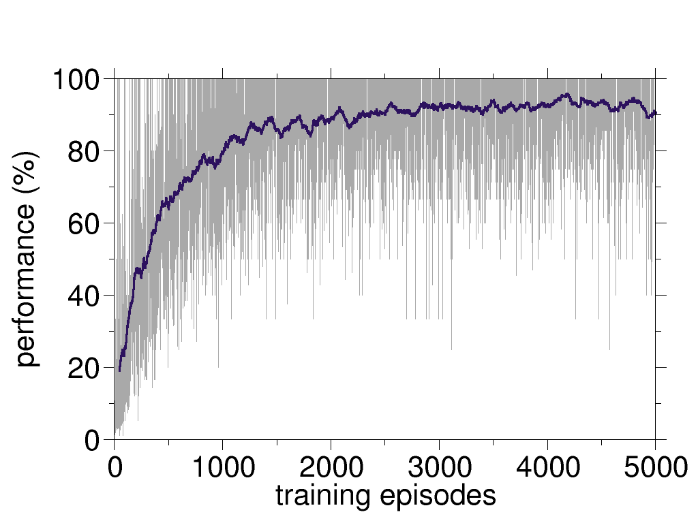
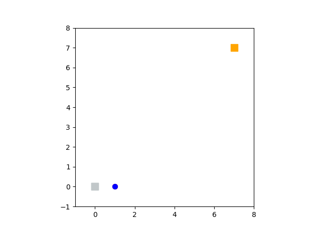

# simplest-world-REINFORCE

the *simplest-world* provides a simple environment for the agents. Here, the world is made ultimately simple to leave some room for the RL complications. This is the first of hopefully-a-series of clean implementations of different RL approaches. 

## requirements
Besides the python3 and pip3

* keras
* numpy
* random
* seaborn
* tensorflow (version 2)

```
pip3 install -r requirements.txt
```
## usage

To use it one can run:
```
python3 experience-and-learn.py
```
This script runs experiments for a policy and improves it. 


## monitoring peformance

An advantage of a simplest world is that we know almost everything about it! Specifically, given your initial state, one can calculate the number of steps to reach the terminal state under the **optimal** policy. Here is the performance plotted against the number of trainings.



Using the simulator one can observe two agents competing to reach to the goal position (top-right corner). The red agent is not trained, and the blue one is the trained one. 



To run the simulation:

```
python3 simulator.py
```

and to convert the PNG files to a GIF by:


```
bash converting-pngs-to-gif.sh
```

in the ``animations``` directory.

## tips and tricks
