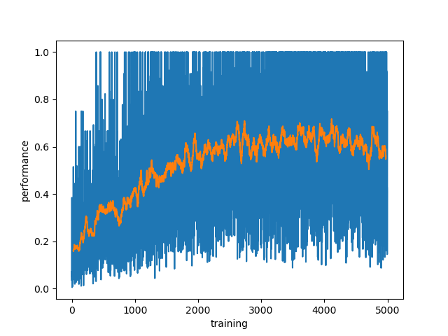

# simplest-world-REINFORCE

the *simplest-world* provides a simple environment for the agents. Here, the world is made ultimately simple to leave some room for the RL complications. This is the first of hopefully-a-series of clean implementations of different RL approaches. 


## requirements
* keras
* numpy
* random
* seaborn
* tensorflow

```
pip install -r requirements.txt
```
## usage

To use it one can run:
```
python3 experience-and-learn.py
```
## monitoring peformance

An advantage of a simplest world is that we know almost everything about it! Specifically, given your initial state, one can calculate the number of steps to reach the terminal state under the **optimal** policy.



## tips and tricks
